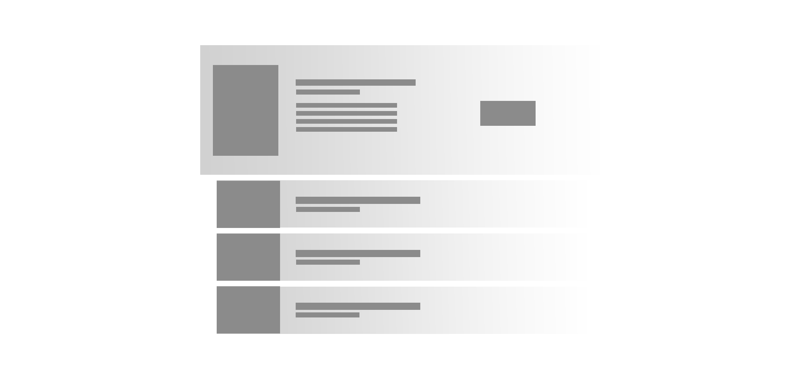

# LitShelf | Your Ultimate Digital Bookshelf for Literature Lovers

## 🌐 Socials:
  

##LitShelf is a digital bookshelf designed to make discovering, browsing, and purchasing books effortless. Featuring curated book selections, immersive book cards, and intuitive call-to-action buttons, LitShelf enhances the reading experience for literature enthusiasts.

---
## 🚀 Features

- 📚 **Realistic Page-Turning Animation** – Smooth and elegant CSS-powered page transitions.
- 🎯 **Interactive UI** – Engaging user experience with intuitive page navigation.
- 🎨 **No JavaScript Required** – The page-flipping effect is achieved with pure CSS.
- 🧑‍💻 **Easy to Customize** – Perfect for digital books, portfolios, or creative content.

---

## 🛠️ Tech Stack

- **HTML5**
- **CSS3 (Flexbox, Transitions, Transformations)**
- **SASS (optional for easier management of styles)**

---
---

 
Desktop Desgin 

 
Desktop Desgin ui-ux Layout 

 
Desktop Desgin 

 
Cover 
